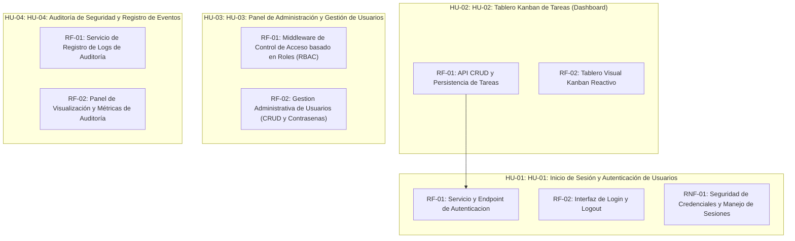

# Grafo de Dependencias -- projectoPrueba

_Generado automaticamente el 2026-08-14T13:33:12.626Z -- no editar a mano, se sobreescribe en cada publicacion._

```mermaid
graph TD
  subgraph US_1786548038997["HU-01: HU-01: Inicio de Sesión y Autenticación de Usuarios"]
    REQ_1786550047158["RF-01: Servicio y Endpoint de Autenticacion"]
    REQ_1786550047244["RF-02: Interfaz de Login y Logout"]
    REQ_1786550047330["RNF-01: Seguridad de Credenciales y Manejo de Sesiones"]
  end
  subgraph US_1786548041528["HU-02: HU-02: Tablero Kanban de Tareas (Dashboard)"]
    REQ_1786550047416["RF-01: API CRUD y Persistencia de Tareas"]
    REQ_1786550047501["RF-02: Tablero Visual Kanban Reactivo"]
  end
  subgraph US_1786548043984["HU-03: HU-03: Panel de Administración y Gestión de Usuarios"]
    REQ_1786550047567["RF-01: Middleware de Control de Acceso basado en Roles (RBAC)"]
    REQ_1786550047637["RF-02: Gestion Administrativa de Usuarios (CRUD y Contrasenas)"]
  end
  subgraph US_1786638004323["HU-04: HU-04: Auditoría de Seguridad y Registro de Eventos"]
    REQ_1786638016981["RF-01: Servicio de Registro de Logs de Auditoría"]
    REQ_1786638091109["RF-02: Panel de Visualización y Métricas de Auditoría"]
  end
  REQ_1786550047416 --> REQ_1786550047158
```